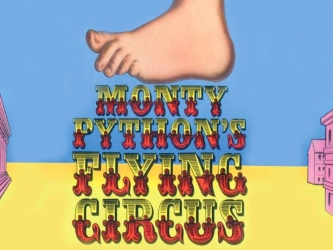

:title: Beginner's Workshop 1
:author: Alexander Loechel
:event: PyLadies Munich - Beginner's Workshop
:keywords: Python, PyLadies, Workshop
:data-transition-duration: 1500
:css: css/workshop1.css
:auto-console: Yes

.. role:: slide-title-line1
    :class: line1

.. role:: slide-title-line2
    :class: line2

.. role:: slide-title-line3
    :class: line3

.. |br| raw:: html

     

----

:id: title
:class: slide title-slide centered level-1
:data-x: 0
:data-y: 0

.. container:: centered

    Welcome to

    .. image:: images/pyladies-munich.png
        :height: 200px
        :class: centered

    Beginner's workshop

.. note::

    * Test Note

----

:id: pyladies
:class: slide level-1
:data-x: r-2500
:data-y: 1000

.. image:: images/pyladies_logo.png
    :height: 100px
    :class: logo left

.. class:: clear tspacer bspacer

    **Welcome!**

.. image:: images/pylady_geek.png
    :height: 150px
    :class: left rspacer

We are an international mentorship group with a focus on helping more women become active participants and leaders in the Python open-source community. Our mission is to promote, educate and advance a diverse Python community through outreach, education, conferences, events and social gatherings.

PyLadies also aims to provide a friendly support network for women and a bridge to the larger Python world. Anyone with an interest in Python is encouraged to participate!

----

:id: python
:class: slide level-1
:data-x: r+0
:data-y: r+1000

* Python is a modern programming language with focus on readabilty and approchabilty

* Python is an interpreted scripting language

* currently Python is the top education language for programming at higher education institutions

* Python is an Multi-paradigm Language

* Copyright by Python Software Foundation

----

:id: goals-orga
:class: slide centered level-1
:data-x: r+0
:data-y: r+1000

Goals of PyLadies Munich
========================

*statement by PyLadies Munich Organizers*

----

:id: my-goals
:class: slide level-1
:data-x: r+0
:data-y: r+1000

My Goals
========

* make you feel comfortable with programming and Python
* get you able to write small programs in Python

* tell you about

    * programming
    * programmers habits
    * programmers and open source community
    * IT & programmers / software engineers philosophy

I reached my goal if
====================

* you will held a talk at a Python User Group meeting
* you join a sprint or hackathron
* you contribute to a Python open source project

----

:id: workshop-goals
:class: slide level-1
:data-x: r+0
:data-y: r+1000

Goals of the workshop
=====================

* teach all necessary skills on basic programming
* tell you about programmers habits and philosophy

What is not part of the workshop
================================

a series of 8-12 workshops would not give the same as a full education program on programming or even computer science.
We won't do computational theory, too match math, repeat basic algorithms

----

:id: your-goals
:class: slide level-1
:data-x: r+0
:data-y: r+1000

Your goals?
===========

Which goals do you have for this workshop series?

* learning straight programming
* understanding programmers
* understand code
* ...

----

:id: questions-direction
:class: slide level-1
:data-x: r+0
:data-y: r+1000

Preferred Direction of Workshop / Training
==========================================

* Web-Development
* Scientific Programming / Data Analysis / Data Mining
* Operations (Administrative Work / Scripting)
* Testing
* ...

----

:id: syslab
:class: slide level-1
:data-x: r+1000
:data-y: 1000

Syllabus of the planned curriculum
==================================

* Workshop 1 - **Introduction, Setup and first steps** (Today)
* Workshop 2 - **Theory of data types and data structures** |br|
  For beginners, March 12th 2015)

* Workshop 3 - **Theory of data flow / data contol** |br|
  (For beginners, April 2nd 2015)

* Workshop 4 - **Repeating Workshop** |br|
  (For beginners and language changer)

* Workshop 5 and ongoing: |br|
  More specialized on your preferred direction

.. class:: centered tspacer

    *up to 8-12 Workshops*

----

:id: questions
:class: slide level-1
:data-x: r+0
:data-y: r+1000

Question
========

To get to know you a few question on your prior experience

----

:id: questions-edu
:class: slide level-1
:data-x: r+0
:data-y: r+1000

Educational Condition
=====================

* Who of you has a collage / university degree
* Which field of Study

  * Formal Science (Math, ...)
  * Natural Science (Physikcs, Chemestry, ...)
  * Social Science
  * Humanities
  * Professions

    * Business / Economics
    * Engeneering
    * Legal Science
    * Education
    * Languages
    * Medicine

* Is everyone aware of names and concepts like "Noam Chomsky" / "Chomsky-Grammar" and "Syntax" & "Sematics"

----

:id: questions-tech-prep
:class: slide level-1
:data-x: r+0
:data-y: r+1000

Any prior Programming Skills / Languages
========================================

* Java
* C
* Perl
* Ruby
* ...

----

:id: questions-os
:class: slide level-1
:data-x: r+0
:data-y: r+1000

Which Operating System are you using?
=====================================

* Mac OS X
* Linux / Unix

  * Ubuntu / Debian-Family
  * CentOS / RedHat-Family
  * Gentoo-Family
  * FreeBSD

* Windows

----

:id: intro-python
:class: slide level-1
:data-x: r+1000
:data-y: 1000

Introduction to Python
======================

.. code:: python

    # Python 3: Fibonacci series up to n
    def fib(n):
        a, b = 0, 1
        while a < n:
            print(a, end=' ')
            a, b = b, a+b
        print()
    fib(1000)

What we see:

* very readable code

    * no curling brackets {} --> indention syntax
    * no **;** (Semicolons)
    * very few brackets

* special programming features

    * atomic multi assignment of variables

----

:id: history-python
:class: slide level-1
:data-x: r+0
:data-y: r+1000

History of Python
=================

.. image:: images/guido.jpg
    :height: 200px
    :class: left rspacer

Guido van Rossum
----------------

Guido van Rossum designed Python 1991 at Centrum Wiskunde & Informatica Amsterdam as a successor to the ABC language
for the Amoeba operating system (Andrew S Tannenbaum).

He is a *"benevolent dictator for live"*

.. class:: clear

Name origin
-----------

Python is named in honour of Monty Python

----

:id: zen-ipython
:class: slide level-1
:data-x: r+0
:data-y: r+1000

.. raw:: html

    <iframe width="775" height="600" src="http://localhost:8888/notebooks/zen.ipynb" frameborder="0" ></iframe>

http://localhost:8888/notebooks/zen.ipynb

----

:id: zen
:class: slide level-1
:data-x: r+0
:data-y: r+1000

The Zen of Python
=================

.. code:: python

    >>> import this
    The Zen of Python, by Tim Peters

    Beautiful is better than ugly.
    Explicit is better than implicit.
    Simple is better than complex.
    Complex is better than complicated.
    Flat is better than nested.
    Sparse is better than dense.
    Readability counts.
    Special cases aren't special enough to break the rules.
    ...

----

:id: packages
:class: slide level-1
:data-x: r+0
:data-y: r+1000

Amount of Libraries and Packages for Python
===========================================

more that 55.000 Python Packages available.

famous Packages
---------------

* Scientific

  * numpy
  * scipy
  * matplotib

* Web Frameworks

  * web2py
  * Flask
  * Django
  * Pyramid
  * Tornado

* Server Administration, Orchestration and Monitoring

  * Ansible
  * Salt
  * Fabric
  * Graphit

* others

  * Zope
  * Plone
  * scrapy
  * lxml
  * SQLAlchemy
  * subversion
  * supervisor
  * Diazo
  * Trac

----

:id: giants
:class: slide level-1
:data-x: r+0
:data-y: r+1000

We are standing on the shoulders of giants
==========================================

.. image:: images/giants_shoulders.jpg
    :height: 500px
    :class: centered

----

:id: tools
:class: slide level-1
:data-x: r+1000
:data-y: 1000

Tools
=====

For the Workshop there are some Tools necessary:

* Meetup.com
* Python Interpreter
* Editor
* virtualenv & pyvenv
* git & github.com
* IPython & IPython Notebook
* Pyramid

----

:id: meetup
:class: slide level-1
:data-x: r+0
:data-y: r+1000

Meetup.com
==========

* All Workshops will be anounced via http://www.meetup.com/PyLadiesMunich/
* Questions & Answers
* You have to have a Meetup account and be member of http://www.meetup.com/PyLadiesMunich/

----

:id: check-python
:class: slide level-1
:data-x: r+0
:data-y: r+1000

Python Interpreter
==================

let us check if Python is already available on your notebook:

.. code:: bash

    $ python2 -V
    Python 2.7.6

    $ python3 -V
    Python 3.4.0

----

:id: install-python
:class: slide level-1
:data-x: r+0
:data-y: r+1000

Python Interpreter
==================

Install Python

Mac OS X
--------

Use Homebrew

.. code:: bash

    brew install python3
    brew install python

Linux (Debian/Ubuntu)
---------------------

.. code:: bash

    aptitude install python3.4
    aptitude install python2.7

Windows
-------

use Windows-Installer from:

* https://www.python.org/downloads/release/python-342/
* https://www.python.org/downloads/release/python-279/

----

:id: editors
:class: slide level-1
:data-x: r+0
:data-y: r+1000

Editor
======

for programming you need an editor. It should support you:

* show whitespaces and line brakes
* maybe syntax highlighting

Examples
--------

* Windows: notpad++ (http://notepad-plus-plus.org/)
* Linux: GEdit (https://wiki.gnome.org/Apps/Gedit)
* Mac: TextMate (http://macromates.com/)

My Prefernces
-------------

* Text-Editor: Sublime Text (http://www.sublimetext.com/)
* IDE: PyCharm (http://www.sublimetext.com/)

.. class:: centered

    **Take whatever you are comfortable with**

----

:id: pyvenv
:class: slide level-1
:data-x: r+0
:data-y: r+1000

virtualenv & pyvenv
===================

Virtual Environments are an isolation layer to python

* Helps you to keep dependecies clean
* seperate applications from each other

* virtualenv for Python 2
* pyvenv part of Python 3

Setup a virtualenv
------------------

.. code:: bash

    pyvenv venv-name

Usage of an virtualenv
----------------------

.. code:: bash

    source venv-name/bin/activate

afterwards the path environments found all commands in venv-name/bin first

----

:id: pypi
:class: slide level-1
:data-x: r+0
:data-y: r+1000

PyPI, setuptools & pip
======================

* **pypi** = the **Py**\ thon **P**\ ackage **I**\ ndex (https://pypi.python.org/pypi)
* **setuptools & easy_install** = old Package Manager for Python
* **pip** = modern Package Manager for Python

install an aditional Python package
-----------------------------------

.. code:: bash

    pip install package-name

Search for additional packages
------------------------------

.. raw:: html

    <iframe width="775" height="270" src="https://pypi.python.org/pypi" frameborder="0" ></iframe>

----

:id: git
:class: slide level-1
:data-x: r+1000
:data-y: 1000

git & github
============

* git
    distributed version control system

* github (https://github.com/)
    web-based git repository hosting service

    Any example code will be avaliable via https://github.com/PyLadies-Munich

----

:id: gitcommands
:class: slide level-1
:data-x: r+0
:data-y: r+1000

important git commands
======================

* **git init** - initalize an empty local git repository
* **git clone** - clone a git repository
* **git status** - show status
* **git diff** - show differences between revisions
* **git add** - add file to version control / nex commit
* **git remove** - delete file from version control
* **git commit** - commit added files to version control history
* **git branch** - show git branches
* **git checkout** - check a branch or revision out
* **git pull / git fetch** - get updates from remote location
* **git push** - push changes to remote / origin location

.. class:: centered tspacer

    a good short introduction to git: |br| http://rogerdudler.github.io/git-guide/index.html

----

:id: ipython
:class: slide level-1
:data-x: r+0
:data-y: r+1000

IPython & IPython Notebook
==========================

**IPython** is an powerful interactive shell for python, with:

* syntax highlighting
* tab completion

**IPython Notebook** is an additional browser-based interactive Shell with many features:

* support for code
* inline plots
* rich media

http://ipython.org/

----

:id: ipython-install
:class: slide level-1
:data-x: r+0
:data-y: r+1000

Install IPython and IPython Notebook
====================================

.. code:: bash

    # create virual environment
    $ pyvenv venv-py34.ipython
    $ source venv-py34/bin/activate
    $ pip install ipython[notebook] ipdb

----

:id: pdb
:class: slide level-1
:data-x: r+0
:data-y: r+1000

Python Debugger
===============

* **pdb** - standard Python Debugger
* **ipdb** - Python Debugger with IPython integration

  * tab completion
  * syntax highlighting

.. class:: centered tspacer

    **Debugging of code is the fundamental thing to understand programms**

----

:id: pyramid
:class: slide level-1
:data-x: r+0
:data-y: r+1000

Pyramid
=======

.. image:: images/pyramid-logo.png
    :class: centered

.. class:: tspacer

    **Pyramid** is a micro / makro **web framework** in Python

* http://www.pylonsproject.org/
* http://www.pylonsproject.org/projects/pyramid/about

.. class:: tspacer

    It will be used during the workshops as a simple example tool. It has very good documentations
    http://docs.pylonsproject.org/en/latest/

----

:id: other-tools
:class: slide level-1
:data-x: r+0
:data-y: r+1000

Other Tools
===========

there are so many tools for Python and programming so that it is impossible to name all, but some few more:

* linter and anaylizers: pep8, pyflakes, ...
* testing tools: py.test, nose, doctests, mock, ...
* buildtools: zc.buildout
* ...

----

:id: first-python
:class: slide level-1
:data-x: r+1000
:data-y: 1000

First Python Programming Steps
==============================

Classic Hello World!
--------------------

start python with:

.. code:: bash

    $ python2
    Python 2.7.6 (default, Sep  9 2014, 15:04:36)
    [GCC 4.2.1 Compatible Apple LLVM 6.0 (clang-600.0.39)] on darwin
    Type "help", "copyright", "credits" or "license" for more information.
    >>>

leave python with **crtl+D**

----

:id: basic-hello-world
:class: slide level-1
:data-x: r+0
:data-y: r+1000

Basic "Hello World" in Pure Python Interpreter
==============================================

Python 3
--------

.. code:: python

    >>> print('Hello World')
    Hello World

Python 2 (good style)
---------------------

.. code:: python

    >>> from __future__ import print_function
    >>> print('Hello World')
    Hello World

Python 2 (old style)
---------------------

.. code:: python

    >>> print 'Hello World'
    Hello World

----

:id: ipython-hello-world
:class: slide level-1
:data-x: r+0
:data-y: r+1000

Hello World on IPython Interpreter
==================================

start ipython with:

.. code:: bash

    $ ipython
    Python 3.4.2 (default, Oct 16 2014, 05:21:12)
    Type "copyright", "credits" or "license" for more information.

    IPython 2.3.1 -- An enhanced Interactive Python.
    ?         -> Introduction and overview of IPython's features.
    %quickref -> Quick reference.
    help      -> Python's own help system.
    object?   -> Details about 'object', use 'object??' for extra details.

    In [1]:

Execute print('Hello World')

.. code:: python

    In [1]: print('Hello World')
    Hello World

----

:id: ipython-notebook-hello-world
:class: slide level-1
:data-x: r+0
:data-y: r+1000

Hello World on IPython Notebook
===============================

.. code:: bash

    cd venv-py34.ipython
    source ./bin/activate
    ipython notebook
    2015-02-26 [NotebookApp] Using existing profile dir: '/Users/alex/.ipython/profile_default'
    2015-02-26 [NotebookApp] Using MathJax from CDN: https://cdn.mathjax.org/mathjax/latest/MathJax.js
    2015-02-26 [NotebookApp] Serving notebooks from local directory: /path
    2015-02-26 [NotebookApp] 0 active kernels
    2015-02-26 [NotebookApp] The IPython Notebook is running at: http://localhost:8888/
    2015-02-26 [NotebookApp] Use Control-C to stop this server and shut down all kernels (twice to skip confirmation).

open http://localhost:8888/

----

:id: pyramid-hello-world
:class: slide level-1
:data-x: r+0
:data-y: r+1000

Hello World on Pyramid
======================

.. code:: bash

    pyvenv venv-py34.pyramid
    cd venv-py34.pyramid
    source ./bin/activate
    git clone https://github.com/PyLadies-Munich/pyladies_base_app.git
    cd pyladies_base_app
    python setup.py develop
    pserve development.ini --reload

http://localhost:6543/

----

:id: pyramid-traversal-hello-world
:class: slide level-1
:data-x: r+0
:data-y: r+1000

Hello {name} on Pyramid
=======================

.. code:: bash

    git branch step-2
    python setup.py develop
    pserve development.ini --reload

http://localhost:6543/

Documentation and Tutorial on Pyramid:

http://docs.pylonsproject.org/projects/pyramid/en/latest/narr/firstapp.html

----

:id: next-meeting
:class: slide centered level-1
:data-x: 0
:data-y: 8000

Next Workshop
=============

.. image:: images/pyladies-munich.png
    :height: 200px
    :class: centered

March 10th 2015 18:30

**Theory of data types and data structures**

----

:id: overview
:data-x: 0
:data-y: 4000
:data-scale: 10
