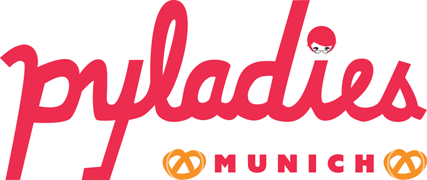

:title: Beginner's Workshop 3
:author: Alexander Loechel
:event: PyLadies Munich - Beginner's Workshop
:keywords: Python, PyLadies, Workshop
:data-transition-duration: 1500
:css-all: css/workshop3.css
:auto-console: Yes

.. role:: slide-title-line1
    :class: line1

.. role:: slide-title-line2
    :class: line2

.. role:: slide-title-line3
    :class: line3

.. |br| raw:: html

     

.. |hr| raw:: html

    

.. role:: python(code)
   :class: highlight code python
   :language: python

----

:id: title
:class: slide title-slide centered level-1
:data-x: 0
:data-y: 0

.. container:: centered

    Welcome to

    .. image:: images/pyladies-munich.png
        :height: 200px
        :class: centered

    Beginner's workshop 3

    **Theory** of **data flow** and **data control**

.. note::

    * Test Note

----

:id: recap-ws1
:class: slide level-1
:data-x: r-1500
:data-y: 1000

Recap Workshop 1
================

* Introduction

  * PyLadies
  * Python
  * Questions
  * Syllabus of planned curriculum

* What is Python

  * About the Language
  * History and Background

* Basic Philosophy - The Zen of Python
* Tools and Setup

  * Python Interpreter
  * Virtual Environments
  * pip & easy_install

* Hello World example

----

:id: syslab
:class: slide level-1
:data-x: r+0
:data-y: r+1000

Syllabus of the planned curriculum
==================================

* Workshop 1 - **Introduction, Setup and first steps** (February 26th 2015)
* Workshop 2 - **Theory of data types and data structures** |br|
  For beginners, March 12th 2015)

* Workshop 3 - **Theory of data flow / data contol** |br|
  (For beginners, April 1nd 2015)

* Workshop 4 - **Repeating Workshop** |br|
  (For beginners and language changer, April 16th 2015)

* Workshop 5 and ongoing: |br|
  More specialized on your preferred direction:
  web-development and data

.. class:: centered tspacer

    *up to 8-12 Workshops*

----

----

:id: recap-ws2
:class: slide level-1
:data-x: r+0
:data-y: r+1000

Recap Workshop 2
================

----

:id: intro-python
:class: slide level-1
:data-x: r+1000
:data-y: 1000

Introduction to Python
======================

.. code:: python
    :number-lines:

    # Python 3: Fibonacci series up to n
    def fib(n):
        a, b = 0, 1
        while a < n:
            print(a, end=' ')
            a, b = b, a+b
        print()
    fib(1000)

Important parts we see
----------------------

* method definition  :python:`def fib(n)`
* variables :python:`a, b`
* discrete values :python:`0, 1, 1000`
* data flow / control element for a loop: :python:`while`
* method calls :python:`print()` & :python:`fib()`

----

:id: base
:class: slide level-1
:data-x: r+0
:data-y: r+1000

Basic Elements of a |br| Programming Language
=============================================

* Paradigm

* Data types

  * Objects
  * Primitive data types
  * Composite types

* Module / Module Hierarchy

* Data Flow / control (*topic of next workshop*)

----

:id: paradigm
:class: slide level-1
:data-x: r+0
:data-y: r+1000

Paradigm
========

In computer science there are multiple paradigms

* functional
* imperative

  * modular
  * object oriented

* logical
* aspect oriented
* declarative

for higher programming languages

.. class:: centered tspacer

    All programming language have the *same power* - they are *turing complete*

----

:id: prglangclasses
:class: slide level-1
:data-x: r+0
:data-y: r+1000

Classes of Programming Languages
================================

* **machine code** - Bits & Bytes - 0/1 - punched cards

* **assembler code** - formal representation of CPU commands

  .. code:: cpp-objdump

     0:   80 81 70 70 82 83 71  add   BYTE PTR [ecx-2088603536],0x71
     7:   71 50                 jno   59 <gs_VLCDecodeTable+0x59>
     9:   50                    push  eax
     a:   50                    push  eax

* **higher programming languages** - Everything that is compiled into *machine code*, base is often C or Fortran

----

:id: gha
:class: slide centered level-1
:data-x: r+0
:data-y: r+1000

Compiler and availability of |br| higher programming languages
==============================================================

Rear Admiral Grace Hopper (1906 - 1992)
---------------------------------------

* 1969 inaugural Computer Science Man of the Year of Data Processing Management Association
* since 1971 ACM Grace Murray Hopper Award for Outstanding Young Computer Professionals

----

:id: compilers
:class: slide level-1
:data-x: r+0
:data-y: r+1000

Excursion on Compilers
=======================

* bootstrapping - bootstrap paradox & Münchhausen trilemma
* every compiler of a good programming language is written in this programming language
* Compilers map a understandable native Language (English on a reduced set of Chomsky Type-3 grammar/EBNF) to a computer processable machine code

  * higher programming languages define a syntax and a semantic
  * Programming languages are abstractions of computable definitions or execution concepts

* Computer architectures defines a set of primitive types they support

  * Compilers allow to construct complex types as a combination of primitive types
  * --> Python primitive types and the GIL (global interpreter lock) will be discussed at workshop 4

.. note::

  * Münchhausen trilemma - pulling himself and the horse on which he was sitting out of a mire by his own hair

  * almost all base Compilers are written in C and than bootstrap itself into their own language

----

:id: eduproblem
:class: slide level-1
:data-x: r+0
:data-y: r+1000

The problem of |br| computer science education
==============================================

* Basics are on algorithm and data structures (see Robert Sedgewick books on Algorithms,
  https://www.coursera.org/course/algs4partI)

* Every student have to learn all basic algorithms, in practice the will never implement them nor extend them.
  Everything is focused on algorithm.

* The most important thing in effective data handling is knowledge of data structures and limits.

* A optimized data structure is often up to a 100 times more effective than an optimized algorithm

  .. pull-quote::

    Smart data structures and dumb code works a lot better than the other way around

    -- Eric Raymond

----

:id: base_unix_c
:class: slide level-1
:data-x: r+1000
:data-y: 1000

Basics for all |br| modern Programming Languages
================================================

* Mostly all programming languages base on **C**

  * **C** was a fundamental part of Unix

  * **Unix** has a philosophy that influence most scripting and programming languages

  * From **C** there comes data primitives which represents the CPU architectural data types

* Compilers and Interpreters make them platform independent

* Programming Languages differ on focus, approachability and strictness

  * typing
  * supported paradigms
  * execution environment
  * elegance

----

:id: basic_phils
:class: slide level-1
:data-x: r+0
:data-y: r+1000

Two basic Unix Philosophies
---------------------------

    Write programs that do one thing and do it well. Write programs to work together. Write programs to handle text streams, because that is a universal interface.

    -- Doug McIlroy

* small modules - *eggs / wheels*
* pipelines
* data exchange

|hr|

    Everything is a file

all input/output resources behave like a file

* Documents, Folders & Directories
* Devices
* Inter-Process and network communications

all are exposed as *simple streams of bytes* through the filesystem name space

----

:id: oo
:class: slide level-1
:data-x: r+0
:data-y: r+1000

Object Oriented Programming
===========================

* math & imperative programming was one of the first approaches for programming.
  for most people it is not intuitive.
  humans think in **objects** and **classes of objects**

*

    Objects are Python’s abstraction for data. All data in a Python program is represented by objects or by relations between objects.

    -- https://docs.python.org/3/reference/datamodel.html

* Python is **strongly typed**

----

:id: duck
:class: slide level-1
:data-x: r+0
:data-y: r+1000

Duck Typing
===========

    When I see a bird that walks like a duck and swims like a duck and quacks like a duck, I call that bird a duck.

    -- James Whitcomb Riley

    In other words, don't check whether it IS-a duck: check whether it QUACKS-like-a duck, WALKS-like-a duck, etc, etc, depending on exactly what subset of duck-like behaviour you need to play your language-games with.

    -- Alex Martelli comp.lang.python

----

:id: ipython-notebook
:class: slide level-1
:data-x: r+1000
:data-y: 1000

Start IPython Notebook
=======================

.. code:: bash

    cd venv-py34.ipython
    source ./bin/activate
    ipython notebook
    2015-02-26 [NotebookApp] Using existing profile dir: '/Users/alex/.ipython/profile_default'
    2015-02-26 [NotebookApp] Using MathJax from CDN: https://cdn.mathjax.org/mathjax/latest/MathJax.js
    2015-02-26 [NotebookApp] Serving notebooks from local directory: /path
    2015-02-26 [NotebookApp] 0 active kernels
    2015-02-26 [NotebookApp] The IPython Notebook is running at: http://localhost:8888/
    2015-02-26 [NotebookApp] Use Control-C to stop this server and shut down all kernels (twice to skip confirmation).

open http://localhost:8888/

----

:id: try
:class: slide centered level-1
:data-x: r+0
:data-y: r+1000

All following explanations and examples are practical session

please open your |br| **IPython Notebook** http://localhost:8888/

----

:id: next-meeting
:class: slide centered level-1
:data-x: 0
:data-y: 8000

Next Workshop
=============

Thursday April 2nd 2015 18:30

**Theory** of **data flow** / |br| **data control**

----

:id: overview
:data-x: 0
:data-y: 4000
:data-scale: 10
